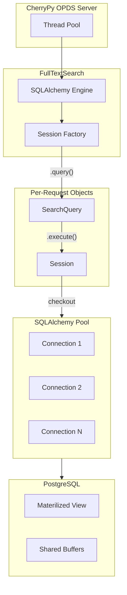

# Gutenberg Full-Text Search

A PostgreSQL-backed full-text search engine for Project Gutenberg with OPDS 2.0 catalog support.

## Requirements

### Python Dependencies

```bash
python3 -m venv .venv && source .venv/bin/activate && pip install -r requirements.txt
```

### PostgreSQL Extensions

The materialized view requires these extensions:

```sql
CREATE EXTENSION IF NOT EXISTS pg_trgm;    -- Fuzzy/trigram search
CREATE EXTENSION IF NOT EXISTS pg_prewarm; -- Cache warming
```

### Database Setup

1. Import the Project Gutenberg database
2. Build the materialized view:
   ```bash
   psql -U postgres -d gutendb -f mv_books_dc.sql
   ```
3. Prewarm indexes into memory:
   ```bash
   psql -U postgres -d gutendb -f prewarm_mv_books_dc.sql
   ```

## Materialized View: mv_books_dc

Denormalized view containing all book metadata for fast searching.

### Columns

| Column | Type | Description |
|--------|------|-------------|
| book_id | int | Primary key |
| title | text | Book title |
| all_authors | text | Pipe-delimited author names |
| all_subjects | text | Pipe-delimited subjects |
| downloads | int | Download count (last 30 days) |
| lang_codes | text[] | Array of language codes |
| copyrighted | int | 0 = public domain, 1 = copyrighted |
| is_audio | bool | True if audiobook |
| locc_codes | text[] | Library of Congress classification codes |
| dc | jsonb | Full Dublin Core metadata |

### Indexes

| Type | Columns | Use Case |
|------|---------|----------|
| B-tree | downloads, copyrighted, is_audio, author birth/death years | Sorting, equality filters |
| GIN tsvector | tsvec, title_tsvec, author_tsvec, subject_tsvec, etc. | Full-text search |
| GIN trigram | title, all_authors, book_text, etc. | Substring search (ILIKE) |
| GiST trigram | title, all_authors, book_text, etc. | Fuzzy/typo-tolerant search |
| GIN array | lang_codes, locc_codes | Array containment |
| GIN jsonb | dc->'creators', dc->'subjects', dc->'bookshelves' | JSONB containment |

### Refresh

The MV must be refreshed periodically to reflect database changes:

```sql
SELECT refresh_mv_books_dc();
```

Or via cron/systemd timer:

```bash
psql -U postgres -d gutendb -c "SELECT refresh_mv_books_dc();"
```

## FullTextSearch API

### Basic Usage

```python
from FullTextSearch import FullTextSearch, SearchField, SearchType, OrderBy, Crosswalk

fts = FullTextSearch()

# Simple search
result = fts.execute(fts.query().search("Shakespeare")[1, 25])
print(result["total"], result["results"])

# Get single book
book = fts.get(1342)

# Get multiple books
books = fts.get_many([1342, 84, 11])

# Count only
count = fts.count(fts.query().search("Shakespeare"))
```

### Search Types

| Type | Operator | Index | Use Case |
|------|----------|-------|----------|
| FTS | `@@` websearch_to_tsquery | GIN tsvector | Stemmed word matching ("running" matches "run") |
| FUZZY | `<%` word_similarity | GiST trigram | Typo tolerance ("Shakspeare" matches "Shakespeare") |
| CONTAINS | `ILIKE` | GIN trigram | Substring matching ("venture" matches "Adventure") |

```python
from FullTextSearch import SearchField, SearchType

# FTS (default)
q.search("Shakespeare")
q.search("Adventure", SearchField.TITLE)

# Fuzzy
q.search("Shakspeare", SearchField.AUTHOR, SearchType.FUZZY)

# Contains
q.search("venture", SearchField.TITLE, SearchType.CONTAINS)
```

### Search Fields

| Field | FTS | FUZZY | CONTAINS |
|-------|-----|-------|----------|
| BOOK | Yes | Yes | Yes |
| TITLE | Yes | Yes | Yes |
| SUBTITLE | Yes | Yes | Yes |
| AUTHOR | Yes | Yes | Yes |
| SUBJECT | Yes | Yes | Yes |
| BOOKSHELF | Yes | Yes | Yes |
| ATTRIBUTE | Yes | No | No |

### Filter Methods

Built-in filters with index support:

```python
# By ID
q.etext(1342)                    # Single book
q.etexts([1342, 84, 11])         # Multiple books

# By downloads
q.downloads_gte(1000)            # >= 1000 downloads
q.downloads_lte(100)             # <= 100 downloads

# By copyright
q.public_domain()                # copyrighted = 0
q.copyrighted()                  # copyrighted = 1

# By language (matches any language in multi-language books)
q.lang("en")                     # English
q.lang("de")                     # German

# By format
q.text_only()                    # Exclude audiobooks
q.audiobook()                    # Only audiobooks

# By author dates
q.author_born_after(1900)
q.author_born_before(1700)
q.author_died_after(1950)
q.author_died_before(1800)

# By release date
q.released_after("2020-01-01")
q.released_before("2000-01-01")

# By classification
q.locc("PS")                     # LoCC code prefix match

# By file type
from FullTextSearch import FileType, Encoding
q.file_type(FileType.EPUB)
q.file_type(FileType.PDF)
q.encoding(Encoding.UTF8)

# By ID (JSONB containment)
q.author_id(53)                  # Mark Twain
q.subject_id(1)
q.bookshelf_id(68)
q.has_contributor("Illustrator")

# Custom SQL
q.where("jsonb_array_length(dc->'creators') > :n", n=2)
```

### Chaining

All methods return `self` for chaining:

```python
result = fts.execute(
    fts.query()
    .search("Adventure", SearchField.TITLE)
    .lang("en")
    .public_domain()
    .downloads_gte(100)
    .order_by(OrderBy.DOWNLOADS)
    [1, 25]
)
```

### Ordering

```python
from FullTextSearch import OrderBy, SortDirection

q.order_by(OrderBy.RELEVANCE)                    # ts_rank_cd or word_similarity
q.order_by(OrderBy.DOWNLOADS)                    # Default for non-search queries
q.order_by(OrderBy.TITLE)
q.order_by(OrderBy.AUTHOR)
q.order_by(OrderBy.RELEASE_DATE)
q.order_by(OrderBy.RANDOM)
q.order_by(OrderBy.DOWNLOADS, SortDirection.ASC) # Explicit direction
```

### Pagination

```python
q[1, 25]   # Page 1, 25 results per page
q[3, 50]   # Page 3, 50 results per page
q[2]       # Page 2, default 25 per page
```

### Output Formats (Crosswalks)

```python
from FullTextSearch import Crosswalk

fts.query(Crosswalk.FULL)   # All columns: book_id, title, author, downloads, dc
fts.query(Crosswalk.MINI)   # Minimal: id, title, author, downloads
fts.query(Crosswalk.PG)     # Project Gutenberg API format
fts.query(Crosswalk.OPDS)   # OPDS 2.0 publication format
fts.query(Crosswalk.CUSTOM) # Custom transformer (see below)
```

### Custom Transformer

```python
def my_format(row):
    return {
        "id": row.book_id,
        "name": row.title,
        "author": row.all_authors,
    }

fts.set_custom_transformer(my_format)
result = fts.execute(fts.query(Crosswalk.CUSTOM).search("Shakespeare"))
```

### Result Format

```python
{
    "results": [...],      # List of books in crosswalk format
    "page": 1,             # Current page
    "page_size": 25,       # Results per page
    "total": 1234,         # Total matching books
    "total_pages": 50      # Total pages
}
```

## OPDS Server

### Running

```bash
python OPDS.py
```

Server runs at `http://127.0.0.1:8080/opds/`

### Endpoints

| Endpoint | Description |
|----------|-------------|
| /opds/search | Search with facets |
| /opds/search?query=shakespeare | Keyword search |
| /opds/search?query=twain&field=author | Field-specific search |
| /opds/search?lang=en&copyrighted=false | Filtered browse |

### Query Parameters

| Parameter | Values | Default |
|-----------|--------|---------|
| query | Search text | (empty) |
| field | keyword, title, author, fuzzy_keyword, fuzzy_title, fuzzy_author | keyword |
| lang | Language code (en, de, fr, etc.) | (any) |
| copyrighted | true, false | (any) |
| audiobook | true, false | (any) |
| locc | LoCC code (A, B, PS, etc.) | (any) |
| sort | downloads, title, author, release_date, random | relevance |
| sort_order | asc, desc | (default per field) |
| page | Page number | 1 |
| limit | Results per page (1-100) | 20 |

### OPDS 2.0 Compliance

The server implements OPDS 2.0 with:

- Navigation and publications collections
- Faceted search (search field, sort, subject, copyright, format, language)
- Pagination with first/previous/next/last links
- Search URI template

## Testing

```bash
python test.py
```

Runs all search types, filters, and crosswalks with timing output.

## Architecture



- FullTextSearch is thread-safe (stateless, holds only engine/factory)
- Each request gets its own SearchQuery and Session
- Connection pool handles concurrent database access
- PostgreSQL handles parallel query execution
