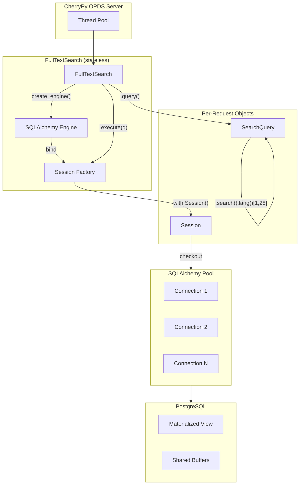

# Gutenberg Full-Text Search

A PostgreSQL-backed full-text search engine for Project Gutenberg with OPDS 2.0 catalog support.

## Requirements

### Python Dependencies

```bash
python3 -m venv .venv && source .venv/bin/activate && pip install -r requirements.txt
```

### PostgreSQL Extensions

The materialized view requires these extensions:

```sql
CREATE EXTENSION IF NOT EXISTS pg_trgm;    -- Fuzzy/trigram search
CREATE EXTENSION IF NOT EXISTS pg_prewarm; -- Cache warming
```

### Database Setup

1. Import the Project Gutenberg database
2. Build the materialized view:
   ```bash
   psql -U postgres -d gutendb -f mv_books_dc.sql
   ```
3. Prewarm indexes into memory:
   ```bash
   psql -U postgres -d gutendb -f prewarm_mv_books_dc.sql
   ```

## Materialized View: mv_books_dc

Denormalized view containing all book metadata for fast searching.

### Columns

| Column | Type | Description |
|--------|------|-------------|
| book_id | int | Primary key |
| title | text | Book title |
| all_authors | text | Pipe-delimited author names |
| all_subjects | text | Pipe-delimited subjects |
| downloads | int | Download count (last 30 days) |
| release_date | date | Publication date (denormalized for fast sorting) |
| lang_codes | text[] | Array of language codes |
| copyrighted | int | 0 = public domain, 1 = copyrighted |
| is_audio | bool | True if audiobook |
| locc_codes | text[] | Library of Congress classification codes |
| dc | jsonb | Full Dublin Core metadata |

### Indexes

| Type | Columns | Use Case |
|------|---------|----------|
| B-tree | downloads, release_date, copyrighted, is_audio, author birth/death years | Sorting, equality filters |
| GIN tsvector | tsvec, title_tsvec, author_tsvec, subject_tsvec, etc. | Full-text search |
| GIN trigram | title, all_authors, book_text, etc. | Substring search (ILIKE) |
| GiST trigram | title, all_authors, book_text, etc. | Fuzzy/typo-tolerant search |
| GIN array | lang_codes, locc_codes | Array containment |
| GIN jsonb | dc->'creators', dc->'subjects', dc->'bookshelves' | JSONB containment |

### Refresh

The MV must be refreshed periodically to reflect database changes:

```sql
SELECT refresh_mv_books_dc();
```

Or via cron/systemd timer:

```bash
psql -U postgres -d gutendb -c "SELECT refresh_mv_books_dc();"
```

## FullTextSearch API

### Basic Usage

```python
from FullTextSearch import FullTextSearch, SearchField, SearchType, OrderBy, Crosswalk

fts = FullTextSearch()

# Simple search
result = fts.execute(fts.query().search("Shakespeare")[1, 28])
print(result["total"], result["results"])

# Get single book
book = fts.get(1342)

# Get multiple books
books = fts.get_many([1342, 84, 11])

# Count only
count = fts.count(fts.query().search("Shakespeare"))
```

### Search Types

| Type | Operator | Index | Speed | Use Case |
|------|----------|-------|-------|----------|
| FTS | `@@` websearch_to_tsquery | GIN tsvector | Fast | Stemmed word matching, supports operators |
| FUZZY | `<%` word_similarity | GiST trigram | Slower | Typo tolerance ("Shakspeare" matches "Shakespeare") |
| CONTAINS | `ILIKE` | GIN trigram | Medium | Substring matching ("venture" matches "Adventure") |

**FTS (Full-Text Search)** - Default, fastest option:
- Uses PostgreSQL `websearch_to_tsquery` 
- Supports boolean operators (see below)
- Default sort: **Relevance** (fast with GIN indexes)
- Best for: Precise searches, exact word matching

**Fuzzy Search** - Typo-tolerant:
- Uses trigram similarity for typo tolerance
- Default sort: **Downloads** (relevance ranking is slow)
- Best for: User input with potential misspellings

```python
from FullTextSearch import SearchField, SearchType

# FTS (default) - fast, supports operators
q.search("Shakespeare")
q.search("Adventure", SearchField.TITLE)

# Fuzzy - typo-tolerant, slower
q.search("Shakspeare", SearchField.AUTHOR, SearchType.FUZZY)

# Contains - substring matching
q.search("venture", SearchField.TITLE, SearchType.CONTAINS)
```

### FTS Search Operators

FTS mode supports PostgreSQL `websearch_to_tsquery` syntax:

| Operator | Example | Meaning |
|----------|---------|---------|
| `"phrase"` | `"to be or not to be"` | Exact phrase match |
| `word1 word2` | `shakespeare hamlet` | AND (both words required) |
| `word1 or word2` | `romeo or juliet` | OR (either word) |
| `-word` | `shakespeare -hamlet` | NOT (exclude word) |

**Examples:**
- `"exact phrase"` - Finds exact phrase
- `adventure novel` - Books with both "adventure" AND "novel"
- `twain or clemens` - Books with "twain" OR "clemens"
- `science -fiction` - Books with "science" but NOT "fiction"

### Search Fields

| Field | FTS | FUZZY | CONTAINS |
|-------|-----|-------|----------|
| BOOK | Yes | Yes | Yes |
| TITLE | Yes | Yes | Yes |
| SUBTITLE | Yes | Yes | Yes |
| AUTHOR | Yes | Yes | Yes |
| SUBJECT | Yes | Yes | Yes |
| BOOKSHELF | Yes | Yes | Yes |
| ATTRIBUTE | Yes | No | No |

### Filter Methods

All filters use optimized MN table joins or indexed columns for fast performance.

```python
from FullTextSearch import LanguageCode, LoccClass, FileType, Encoding

# By ID
q.etext(1342)                    # Single book
q.etexts([1342, 84, 11])         # Multiple books

# By downloads
q.downloads_gte(1000)            # >= 1000 downloads
q.downloads_lte(100)             # <= 100 downloads

# By copyright
q.public_domain()                # copyrighted = 0
q.copyrighted()                  # copyrighted = 1

# By language (matches any language in multi-language books)
q.lang(LanguageCode.EN)          # English
q.lang(LanguageCode.DE)          # German

# By format
q.text_only()                    # Exclude audiobooks
q.audiobook()                    # Only audiobooks

# By author dates
q.author_born_after(1900)
q.author_born_before(1700)
q.author_died_after(1950)
q.author_died_before(1800)

# By release date (uses denormalized column - fast!)
q.released_after("2020-01-01")
q.released_before("2000-01-01")

# By classification (uses MN table - fast!)
q.locc(LoccClass.P)              # LoCC top-level class (prefix match)
q.locc("PS")                     # Optional: narrower LoCC prefix match

# By ID (uses MN tables - fast!)
q.author_id(53)                  # Mark Twain
q.subject_id(1)                  # Uses mn_books_subjects
q.bookshelf_id(68)               # Uses mn_books_bookshelves
q.has_contributor("Illustrator")

# Custom SQL
q.where("jsonb_array_length(dc->'creators') > :n", n=2)
```

### Chaining

All methods return `self` for chaining:

```python
from FullTextSearch import SearchField, OrderBy, LanguageCode

result = fts.execute(
    fts.query()
    .search("Adventure", SearchField.TITLE)
    .lang(LanguageCode.EN)
    .public_domain()
    .downloads_gte(100)
    .order_by(OrderBy.DOWNLOADS)
    [1, 28]
)
```

### Ordering

```python
from FullTextSearch import OrderBy, SortDirection

q.order_by(OrderBy.RELEVANCE)                    # ts_rank_cd (FTS) or word_similarity (Fuzzy)
q.order_by(OrderBy.DOWNLOADS)                    # Default for non-search queries
q.order_by(OrderBy.TITLE)
q.order_by(OrderBy.AUTHOR)
q.order_by(OrderBy.RELEASE_DATE)                 # Fast! Uses denormalized column
q.order_by(OrderBy.RANDOM)
q.order_by(OrderBy.DOWNLOADS, SortDirection.ASC) # Explicit direction
```

**Default sorting:**
- **FTS with query**: Relevance (fast with GIN indexes)
- **Fuzzy with query**: Downloads (relevance is slow for trigrams)
- **No query**: Downloads

### Pagination

```python
q[1, 28]   # Page 1, 28 results per page (default)
q[3, 50]   # Page 3, 50 results per page
q[2]       # Page 2, default 28 per page
```

### Output Formats (Crosswalks)

```python
from FullTextSearch import Crosswalk

fts.query(Crosswalk.FULL)   # All columns: book_id, title, author, downloads, dc
fts.query(Crosswalk.MINI)   # Minimal: id, title, author, downloads
fts.query(Crosswalk.PG)     # Project Gutenberg API format
fts.query(Crosswalk.OPDS)   # OPDS 2.0 publication format
fts.query(Crosswalk.CUSTOM) # Custom transformer (see below)
```

### Custom Transformer

```python
def my_format(row):
    return {
        "id": row.book_id,
        "name": row.title,
        "author": row.all_authors,
    }

fts.set_custom_transformer(my_format)
result = fts.execute(fts.query(Crosswalk.CUSTOM).search("Shakespeare"))
```

### Result Format

```python
{
    "results": [...],      # List of books in crosswalk format
    "page": 1,             # Current page
    "page_size": 28,       # Results per page
    "total": 1234,         # Total matching books
    "total_pages": 45      # Total pages
}
```

## OPDS 2.0 Server

### What is OPDS?

OPDS (Open Publication Distribution System) is a standard for distributing digital publications. OPDS 2.0 uses JSON feeds that e-reader apps (like Thorium, FBReader, etc.) can browse to discover and download books.

### Running the Server

```bash
python OPDS.py
```

Server runs at `http://127.0.0.1:8080/opds/`

### OPDS Catalog Structure

### Endpoints

#### Root Catalog
```
GET /opds/
```
Returns homepage with:
- Navigation links (Search Fuzzy, Search FTS, Browse by LoCC, Most Popular, Recently Added, Random)
- Groups: All curated bookshelves with 20 sample publications each

#### Search
```
GET /opds/search
GET /opds/search?query=shakespeare
GET /opds/search?query=twain&field=fts_keyword&sort=relevance
```

**Search Types:**
- **Fuzzy** (`field=fuzzy_keyword`): Typo-tolerant, slower, sorts by downloads by default
- **FTS** (`field=fts_keyword`): Fast, exact matching, supports operators, sorts by relevance by default

**Query Parameters:**
| Parameter | Values | Default | Description |
|-----------|--------|---------|-------------|
| query | Search text | (empty) | Search query (supports operators in FTS mode) |
| field | `keyword`, `fts_keyword`, `fuzzy_keyword`, `title`, `author`, etc. | `keyword` (fuzzy) | Search field and type |
| lang | Language code (en, de, fr, etc.) | (any) | Filter by language |
| copyrighted | `true`, `false` | (any) | Filter by copyright status |
| audiobook | `true`, `false` | (any) | Filter by format |
| locc | LoCC code (A, B, PS, etc.) | (any) | Filter by Library of Congress classification |
| sort | `downloads`, `relevance`, `title`, `author`, `release_date`, `random` | `relevance` (FTS) or `downloads` (Fuzzy) | Sort order |
| sort_order | `asc`, `desc` | (default per field) | Sort direction |
| page | Page number | 1 | Pagination |
| limit | 1-100 | 28 | Results per page |

**FTS Operators** (when using `field=fts_keyword`):
- `"exact phrase"` - Phrase matching
- `word1 word2` - AND (both required)
- `word1 or word2` - OR (either word)
- `-word` - NOT (exclude)

**Example searches:**
- `/opds/search?query=shakespeare` - Fuzzy search (typo-tolerant)
- `/opds/search?query=shakespeare&field=fts_keyword` - FTS search (fast, exact)
- `/opds/search?query="romeo and juliet"` - Exact phrase (FTS)
- `/opds/search?query=twain or clemens` - OR operator (FTS)
- `/opds/search?query=science -fiction` - Exclude word (FTS)

#### Browse by LoCC (Subject Classification)
```
GET /opds/loccs
GET /opds/loccs?parent=P
GET /opds/loccs?parent=PS&query=novel
```

Hierarchical navigation through Library of Congress Classification:
- Without `parent`: Shows top-level classes (A, B, C, D, E, F, G, H, J, K, L, M, N, P, Q, R, S, T, U, V, Z)
- With `parent`: Shows subclasses or books (if leaf node)
- Supports search and filtering within any LoCC class
- Shows **Top Subjects** facet when viewing books

#### Bookshelves
```
GET /opds/bookshelves
GET /opds/bookshelves?category=Literature
GET /opds/bookshelves?id=644
GET /opds/bookshelves?id=644&query=adventure
```

Curated bookshelves organized by category:
- Without params: Lists all categories
- With `category`: Lists bookshelves in that category
- With `id`: Shows books in that bookshelf with full search/filtering
- Shows **Top Subjects** facet when viewing books
- Search bar stays within the bookshelf context

#### Subjects
```
GET /opds/subjects
GET /opds/subjects?id=1
GET /opds/subjects?id=1&query=novel
```

Subject browsing:
- Without `id`: Lists top 100 subjects by book count
- With `id`: Shows books with that subject, supports search/filtering
- Search bar stays within the subject context

#### Genres (Broad Genre)
```
GET /opds/genres
GET /opds/genres?code=P
GET /opds/genres?code=P&query=poetry
```

Broad genre browsing using top-level LoCC codes:
- Without `code`: Lists all broad genres with book counts
- With `code`: Shows books in that genre with search/filtering

### Facets (Dynamic Filters)

Facets appear on publication pages (search results, browse results) and provide dynamic filtering options:

**Sort By:**
- Most Popular (downloads)
- Relevance
- Title (A-Z)
- Author (A-Z)
- Random

**Top Subjects in Results:**
- Appears when query or filters are active
- Shows up to 15 most common subjects in current results
- Clicking a subject navigates to that subject page (facet disappears, no loop)

**Broad Genre:**
- Library of Congress top-level classes
- Only shown in main search (not in LoCC browse)

**Copyright Status:**
- Any / Public Domain / Copyrighted

**Format:**
- Any / Text / Audiobook

**Language:**
- Any / English / German / French / etc.

### Navigation Behavior

- **Search**: Preserves search type (Fuzzy/FTS) and context (bookshelf, subject, LoCC)
- **Back navigation**: All pages include `rel="start"` link to homepage
- **Up navigation**: Parent pages include `rel="up"` link
- **Search template**: Uses `{?query}` syntax for OPDS-compliant search URIs

## Testing

```bash
python test.py
```

Runs all search types, filters, and crosswalks with timing output.

## Architecture



**Typical usage:**
```python
fts = FullTextSearch()                          # Creates engine + session factory
q = fts.query().search("Shakespeare")[1, 28]    # Builds SearchQuery (no DB hit)
result = fts.execute(q)                         # Session checks out connection, runs query
```

- `FullTextSearch` is thread-safe (stateless, holds only engine/factory)
- Each `.execute()` call gets its own Session (connection checkout/return)
- `SearchQuery` is just a builder—no DB access until `.execute()`
- Connection pool handles concurrent database access